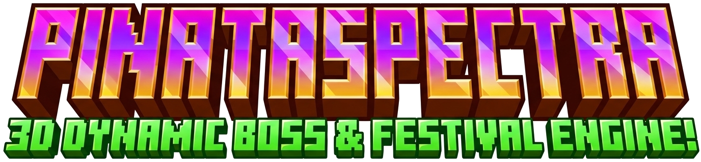



  

  <strong><em>"Where Physics Meets Fantasy — Next-Gen 3D Boss Encounters with Zero-Tick Compromise."</em></strong>

  
  
  
  
  
  

---

## ⚠️ Edition Notice: Sovereign (Premium) vs. Lite Edition

> [!IMPORTANT]
> **This repository represents PinataSpectra — Sovereign Edition (Commercial / Premium Suite).**
> 
> * **Why does PinataSpectra exist?** Traditional Minecraft piñata plugins rely on outdated invisible `ArmorStand` clusters that cause client FPS stutter, packet floods, and lag during high-player events. PinataSpectra was engineered to bring **triple-A 3D procedural boss mechanics, harmonic rope physics, and particle Level of Detail (LOD)** to Minecraft networks without sacrificing a single tick of server performance.
> * **Why is there a separate Lite Edition?** We created **PinataSpectra Lite** as a free, lightweight community alternative for small survival servers that only need a basic static piñata. The **Sovereign Edition** contains the complete proprietary enterprise engine built for network monetization, multi-stage boss combat, and events with **80+ concurrent players at solid 20.0 TPS**.

---

## ⚖️ Comprehensive Feature Comparison Matrix

| Architectural Feature | 🪅 PinataSpectra Sovereign (This Repo) | 🍃 PinataSpectra Lite (Free) | 📦 Legacy / Generic Piñata Plugins |
|---|:---:|:---:|:---:|
| **Target Audience** | Enterprise Networks & Large Communities | Small Vanilla / Survival Servers | Generic Spigot Servers |
| **Entity Core** | Native `ItemDisplay` & `Interaction` (1.20+) | Native `ItemDisplay` (Basic) | 10-30 Invisible `ArmorStands` (High Packets) |
| **80+ Players Scalability** | **20.0 TPS Guaranteed** (Particle LOD) | 20.0 TPS (Basic Scale) | Client FPS Drops & Server Stutters |
| **Suspension Physics** | 3D Catenary Rope & Harmonic Recoil Vector | Static Floating | Static or Basic Leash |
| **Combat Phases** | **4 Dynamic Phases** (Shields & Minions) | Single Health Bar | Single Health Bar |
| **Emotion Morphing** | 4 Dynamic Facial State Morphs | Static Texture | None |
| **Arena Runes** | Animated Ground Runic Perimeter Circle | None | None |
| **Combat Candies** | Ephemeral Candies + **Auto-Sweeper Purge** | None | Permanent Candies (Dupe/Economy Risk) |
| **Leaderboard System** | **54-Slot Async GUI** + Multi-Category DB | Chat Text Only | None or Basic Flatfile |
| **Automation** | **Auto-Scheduler Engine** with Alerts | None | Manual Commands Only |
| **Vote Goal / BossBar** | Community BossBar + NuVotifier Goal | None | None |
| **Custom Model Engine / Oraxen** | Native Hook Support | None | None |
| **Database Storage** | SQLite / MySQL / Redis Pool (HikariCP) | Local Flatfile | YAML Flatfile Only |
| **Support & Updates** | Priority Commercial Support & Features | Community Support | Often Abandoned |

---

## 🎯 Author's Vision & Purpose / Visión del Proyecto

> *"My goal with **PinataSpectra Sovereign** is to redefine how Minecraft server communities experience seasonal festivals and donation milestones. By blending real-time kinematic physics with phased MMO boss mechanics, servers can host awe-inspiring 80+ player battles that feel as polished as a standalone action game, all while maintaining perfect server performance."*  
> — **Dafealru (dr8553097-sudo)**

---

## 🎬 Video Showcase / Demostraciones en Video

| Preview | Video File | Description |
|---|---|---|
| 🎮 **Gameplay Combat** | [`assets/clip_1_gameplay.mp4`](assets/clip_1_gameplay.mp4) | In-game combat, physics, hitboxes & particle effects |
| 🛡️ **Shield & Phases** | [`assets/clip_2_features.mp4`](assets/clip_2_features.mp4) | 4-phase transitions, minion spawns, runic circles & candy consumption |
| 🏆 **Event Finale & GUI** | [`assets/clip_3_showcase.mp4`](assets/clip_3_showcase.mp4) | Grand loot explosion, 54-slot Leaderboard GUI & candy sweep |

---

## ⚡ Core Systems Overview

### 🦄 1. Procedural 3D Display Entity Engine
* Zero client-side mod requirements.
* Pixel-perfect `Interaction` entity hitboxes with harmonic rope physics and angular recoil velocity upon hits.
* **Emotion Morphing:** Facial expressions shift dynamically across *Calm*, *Nervous*, *Angry (Enraged)*, and *Dying*.

### ⚔️ 2. Dynamic 4-Phase Combat State Machine (`PinataPhaseStateMachine`)
* **Phase 1 (Calm):** Initial damage phase with reactive dialogue quotes.
* **Phase 2 (Shield / Minions):** Spawns a magical defensive shield absorbing hits until guardian minions are defeated.
* **Phase 3 (Rage / Frenzy):** Knockback shockwaves, lightning strikes, and enraged particle auras.
* **Phase 4 (Final Stand / Chaos Drop):** Climax soundtrack and progressive multi-colored loot explosions.

### 🔮 3. Smart Particle LOD & Runic Ground Circles
* **Level of Detail (LOD):** Automatically adjusts particle frequency and render distance based on nearby player density to prevent FPS drops on low-end client machines.
* **Runic Floor Circles:** Animated rotating circular particle runes project directly onto the ground beneath floating piñatas.

### 🍬 4. Ephemeral Candies & Candy Sweeper Engine
* Special consumable candies (Buffs, Speed, Regeneration, Strength) that can **only be used while a Piñata event is active**.
* **Global Sweeper Service:** Automatically purges remaining event candies from player inventories, enderchests, and world drops as soon as the event concludes to protect the server economy.

### 🏆 5. 54-Slot Async GUI Leaderboard (`/pinata top`)
* Live ranking GUI with animated glass borders, persistent SQLite/MySQL tracking for **Top Damage Dealers**, **Top Piñata MVPs**, and **Top Candies Consumed**.

### ⏳ 6. Automated Event Scheduler & Vote Party / Donation Goal
* Set automated recurring piñata spawns by interval with advance countdown announcements.
* **Community Vote Goal:** Accumulates server votes with a dynamic community BossBar triggering a Piñata Party once the goal is reached.

---

## 📜 Commands & Permissions

| Command | Permission | Description |
|---|---|---|
| `/pinata spawn <type> [tier]` | `pinataspectra.admin` | Spawns a 3D Piñata at your target location |
| `/pinata top` | `pinataspectra.player` | Opens the 54-slot Interactive Top Leaderboard GUI |
| `/pinata killall` | `pinataspectra.admin` | Instantly removes all active Piñatas and cleans entities |
| `/pinata vote [add\|set] <amount>` | `pinataspectra.admin` | Adds or sets votes towards the Community Vote Party Goal |
| `/pinata scheduler [toggle\|next]` | `pinataspectra.admin` | Manages the automated timed scheduler engine |
| `/pinata sweepcandies` | `pinataspectra.admin` | Manually triggers the global Candy Sweeper purge |
| `/pinata reload` | `pinataspectra.admin` | Hot-reloads all configuration and message files |

---

## 🌐 Official Web Documentation & Wiki

Explore the full interactive documentation portal with live search, copyable configurations, and tutorials:
👉 **[https://dr8553097-sudo.github.io/PinataSpectra/](https://dr8553097-sudo.github.io/PinataSpectra/)**

---

## 👤 Author & Support

- **Developer:** [Dafealru (dr8553097-sudo)](https://dr8553097-sudo.github.io)
- **Portfolio:** [https://dr8553097-sudo.github.io](https://dr8553097-sudo.github.io)
- **GitHub:** [https://github.com/dr8553097-sudo](https://github.com/dr8553097-sudo)

Developed with ❤️ for high-performance Minecraft server communities.
